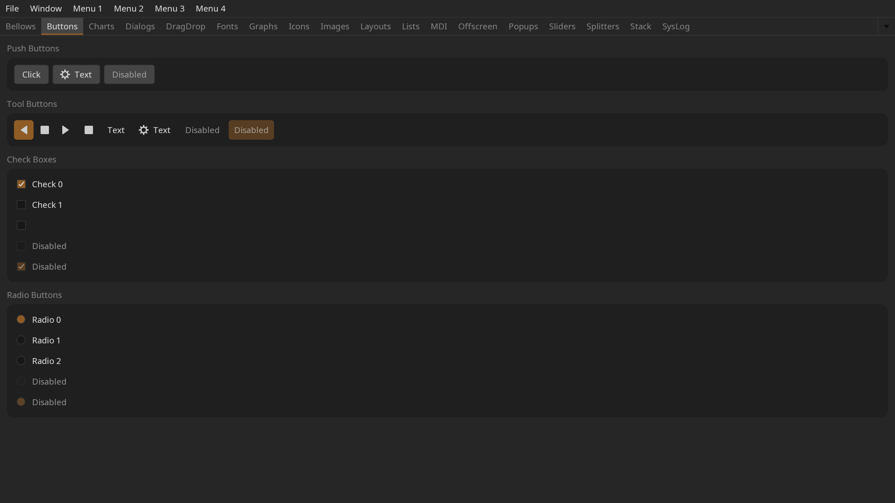

[](https://opensource.org/licenses/BSD-3-Clause)
[](https://github.com/grizzlypeak3d/feather-tk/actions/workflows/ci-workflow.yml)

# &nbsp;feather-tk

A lightweight C++ toolkit for building professional tools for film, VFX, and animation.

feather-tk is purpose-built for media production software, with features like
high-bit-depth color and multi-monitor HiDPI support. It powers [DJV](https://github.com/grizzlypeak3d/DJV),
a production-proven image sequence viewer used in professional VFX and animation workflows.

---

## Why feather-tk?

**Lightweight and self-contained.** feather-tk has a small, well-defined set of
dependencies, and includes a CMake superbuild for building the dependencies.

**Modern C++ throughout.** Clean ownership model using `std::shared_ptr`, a reactive
observable system for UI state, and a consistent event-driven architecture that makes
writing custom widgets straightforward.

**BSD-3-Clause licensed.** Use it freely in commercial production tools.

---

## Used in production

| Project | Description |
|---------|-------------|
| [DJV](https://github.com/grizzlypeak3d/DJV) | Open source image sequence player for high-resolution film, VFX and animation workflows |
| [tlRender](https://github.com/grizzlypeak3d/tlRender) | Library for building playback and review applications for VFX, film, and animation |
| [toucan](https://github.com/OpenTimelineIO/toucan) | Software renderer for OpenTimelineIO timelines |

---

## Features

- **Widget toolkit** — full set of UI widgets including layouts, buttons, sliders, numeric
  editors, menus, toolbars, file browsers, dialogs, tab bars, scroll areas, and a MDI canvas.
- **Observable state** — reactive value, list, and map observables with automatic lifetime
  management; widgets subscribe and unsubscribe cleanly without manual bookkeeping.
- **Action system** — commands with text, icon, keyboard shortcut, checked state, and
  enabled state; a single `Action` drives menus, toolbars, and keyboard handling together.
- **Style and theming** — dark, light, and custom color styles; all sizes and colors are
  role-based so themes apply globally without touching widget code.
- **Settings persistence** — JSON-backed settings with typed get/set and automatic save
  on exit.
- **Widgets from JSON** — layouts loaded from data, with behavior attached in code by
  id; a live preview example reloads a layout as the file is edited.
- **OpenGL rendering** — OpenGL 4.1 and OpenGL ES 2 backends.
- **HiDPI** — display scale awareness throughout; all size roles scale correctly on
  high-density displays and multi-monitor setups.
- **Python bindings** — pybind11-based Python API (work in progress).
- **Testable by design** — applications run headless, write screenshots, and drive
  their own UI from scripts; the same machinery tests feather-tk itself.
- **Cross-platform** — works on Linux, macOS, and Windows.

---

## Scope

feather-tk is a toolkit for media applications -- players, viewers, review
tools -- not a general application framework. Some things are deliberately
out of scope, and knowing them up front saves an evaluation:

- The menu bar is drawn in the window on every platform; there is no native
  macOS menu bar.
- The file browser is feather-tk's own, for consistency across platforms;
  native file dialogs are available through the optional NFD dependency.
- There is no accessibility tree for screen readers.
- Text is aimed at production UI -- file names, timecode, labels. Complex
  scripts and input methods are untested.

What that buys: a stack small enough to read in a sitting, the same pixels
on every platform, and rendering the application controls end to end.

---

## Quick start

Simple C++ example that shows a window with a text label:
```cpp
#include <ftk/UI/App.h>
#include <ftk/UI/Label.h>
#include <ftk/UI/MainWindow.h>

using namespace ftk;

int main(int argc, char** argv)
{
    try
    {
        // Create the context and application.
        auto context = Context::create();
        auto app = App::create(context, argc, argv, "simple", "Simple example.");
        if (app->hasCmdLineHelp())
            return 0;

        // Create a window.
        auto window = MainWindow::create(context, app, Size2I(1280, 960));

        // Create a label.
        auto label = Label::create(context, "Hello world");
        label->setHAlign(HAlign::Center);
        window->setWidget(label);

        // Run the application.
        app->run();
    }
    catch (const std::exception& e)
    {
        std::cout << "ERROR: " << e.what() << std::endl;
        return 1;
    }
    return 0;
}
```

Simple Python example that shows a window with a text label (Python bindings
are a work in progress):
```python
import ftkPy as ftk
import sys

# Create the context and application.
context = ftk.Context()
app = ftk.App(context, sys.argv, "simple", "Simple example")
if app.hasCmdLineHelp:
    sys.exit(0)

# Create a window.
window = ftk.MainWindow(context, app, ftk.Size2I(1280, 960))

# Create a label.
label = ftk.Label(context, "Hello world")
label.hAlign = ftk.HAlign.Center
window.widget = label

# Run the application.
app.run()

# Clean up.
window = None
app = None

```

---

## Widgets from JSON

A widget tree can be created from data: the structure and the properties live in
the JSON, and behavior stays in code.

```json
{
    "type": "VerticalLayout",
    "marginRole": "Margin",
    "children": [
        { "type": "Label", "text": "Hello from JSON" },
        { "type": "FormLayout", "rows": [
            { "label": "Size:", "widget": {
                "type": "IntEditSlider", "id": "size",
                "range": [ 1, 100 ], "value": 25 } }
        ] },
        { "type": "PushButton", "id": "apply", "text": "Apply" }
    ]
}
```

Widgets are given an `"id"` and found in code to attach callbacks, the way markup
and script divide a web page:

```cpp
auto result = ftk::widgetLoad(context, json);
auto button = ftk::findWidget(result.widget, "apply");
```

```python
widget, errors = ftk.widgetLoad(context, jsonString)
ftk.findWidget(widget, "apply").setClickedCallback(callback)
```

The [preview](examples/preview/) example renders a layout file and reloads it as
the file is edited in any editor, with problems shown in the window; the
`ftk_embed_text()` CMake function embeds the same file in the binary for
shipping. Applications register their own widget types with
`ftk::widgetLoadRegister()`.

---

## Examples

Image viewer with menus, toolbars, and persistent settings:


3D object viewer with offscreen rendering and heads-up display:


Text editor with multiple documents:


Gallery of the widgets, layouts, and dialogs:



The examples in the [examples/](examples/) directory:

| Example | Demonstrates |
| --- | --- |
| [simple](examples/simple/) | The minimal application: a window and a label |
| [widgets](examples/widgets/) | Gallery of the widgets, layouts, dialogs, and drag and drop; `-tab <name> -screenshot <file>` captures any page |
| [textedit](examples/textedit/) | Application architecture: documents, actions shared between the menus and tool bars, and persistent settings |
| [imageview](examples/imageview/) | A custom image display widget |
| [objview](examples/objview/) | Custom OpenGL rendering inside a widget |
| [preview](examples/preview/) | Live preview of a widget layout from JSON, reloading as the file is edited |
| [gfx](examples/gfx/) | Procedural drawing |
| [windows](examples/windows/) | Multiple windows |
| [python](examples/python/) | Python counterparts: per-topic scripts, [textedit.py](examples/python/textedit.py) mirroring the C++ textedit for a side by side reading, and [testing.py](examples/python/testing.py), an application that drives and checks itself |

The Python examples mirror the C++ topics. The objview example has no Python
counterpart because the OpenGL layer is deliberately not wrapped; the largest
Python application built on feather-tk is the
[DJV Python example](https://github.com/grizzlypeak3d/DJV/tree/main/examples/python).

---

## Architecture overview

feather-tk is organised into three layers:

**Core** — context and system management, observable values, math and geometry types,
image I/O, font rendering, string utilities, file I/O, LRU cache, command/undo stack.

**GL** — OpenGL abstraction layer: shaders, textures, meshes, offscreen buffers, and
a render interface used by the UI layer.

**UI** — the widget toolkit: the `IWidget` base class and event system, all built-in
widgets, the style system, action system, settings, and the application event loop.

The observable pattern runs throughout. UI state — numeric model values, action checked
state, style changes, window focus — is all expressed as `Observable<T>` values that
widgets subscribe to. Observers unregister automatically on destruction, so there are
no manual disconnect calls and no dangling callbacks.

Widget callbacks are single-slot: setting a callback replaces the previous one.
When more than one party cares about a change, the state belongs in an observable
— any number of observers can subscribe — and the callback's job is only to write
the change into it.

---

## Building

### Dependencies

Required:
- [Freetype](https://freetype.org/)
- [LunaSVG](https://github.com/sammycage/lunasvg)
- [nlohmann JSON](https://github.com/nlohmann/json)
- [PNG](http://www.libpng.org/pub/png/libpng.html)
- [SDL2](https://libsdl.org/) or [SDL3](https://libsdl.org/)
- [ZLIB](https://zlib.net/)

Optional:
- [Native File Dialog Extended](https://github.com/btzy/nativefiledialog-extended) — for native file dialogs
- [pybind11](https://github.com/pybind/pybind11) — for Python bindings

A CMake superbuild script builds all dependencies from source automatically.

### Linux

Requirements:
* Git
* CMake 3.31

Install system packages (Debian/Ubuntu):
```sh
sudo apt-get install build-essential git cmake xorg-dev libglu1-mesa-dev mesa-common-dev mesa-utils
```

Install system packages (Rocky 8 and 9):
```sh
sudo dnf install git libX11-devel libXrandr-devel libXinerama-devel libXcursor-devel libXi-devel mesa-libGL-devel
```

Rocky 8 additionally requires a newer compiler:
```sh
sudo dnf install gcc-toolset-13
scl enable gcc-toolset-13 bash
```

Clone and build:
```sh
git clone https://github.com/grizzlypeak3d/feather-tk.git
sh feather-tk/sbuild-linux.sh
```

### macOS

Requirements:
* Git
* Xcode
* CMake 3.31

```sh
git clone https://github.com/grizzlypeak3d/feather-tk.git
sh feather-tk/sbuild-macos.sh
```

Notes for switching between architectures:
```sh
alias arm="env /usr/bin/arch -arm64 /bin/zsh --login"
alias intel="env /usr/bin/arch -x86_64 /bin/zsh --login"
```

### Windows

Requirements:
* Git (https://git-scm.com)
* Visual Studio 2022
* CMake 3.31

Open "x64 Native Tools Command Prompt for VS 2022" from the Start menu, then:
```bat
git clone https://github.com/grizzlypeak3d/feather-tk.git
feather-tk\sbuild-win.bat
```

### Verify the build

Run the object viewer example:
```sh
# Linux / macOS
build-Release/examples/objview/objview feather-tk/etc/Objects/Bolt.obj

# Windows
build-Release\examples\objview\Release\objview feather-tk\etc\Objects\Bolt.obj
```
